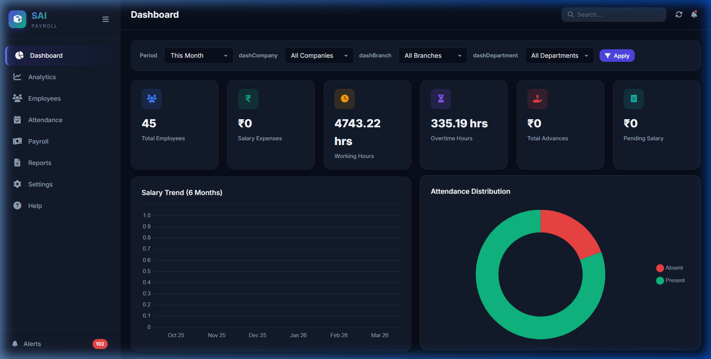

# SAI Payroll

Professional Payroll Management System.

## Features
- Employee Management
- Attendance Tracking
- Salary Processing
- Dashboard & Analytics
- Report Generation (PDF/Excel)
- Backup & Audit Logging

## Technologies Used
- **Backend:** Node.js, Express
- **Database:** SQLite (via sql.js)
- **Frontend:** HTML, CSS, JavaScript
- **Utilities:** multer, pdfkit, xlsx

## Getting Started

### Prerequisites
- Node.js installed on your machine

### Installation
1. Clone the repository:
   ```bash
   git clone <repository-url>
   ```
2. Install dependencies:
   ```bash
   npm install
   ```
3. Start the application:
   ```bash
   npm start
   ```
   *Alternatively, on Windows, simply double-click the `start.bat` file.*
4. Open your browser and navigate to `http://localhost:3000`.

## Screenshot


## License
MIT
